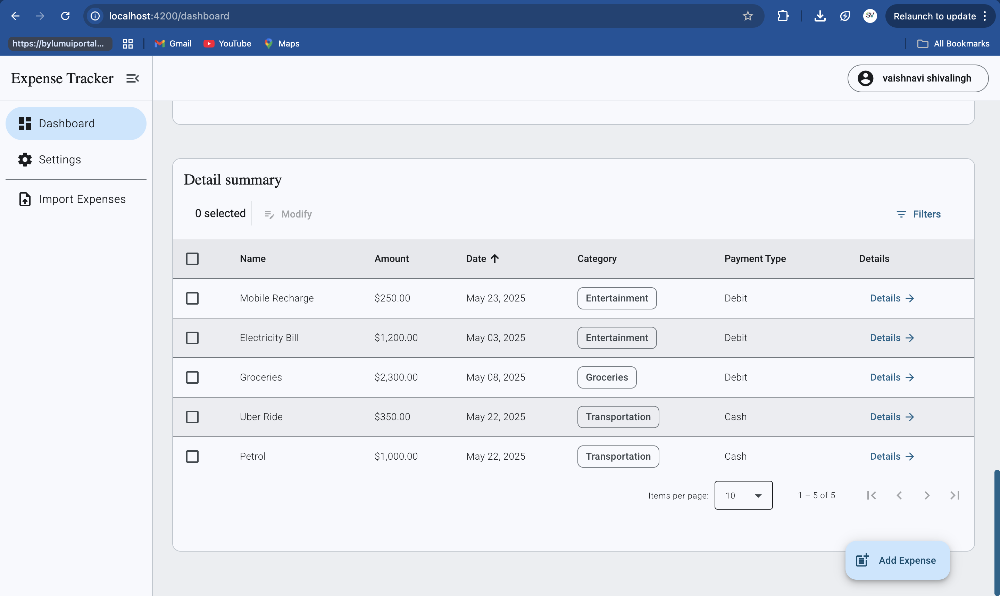
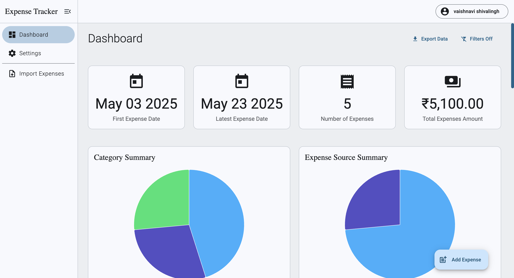
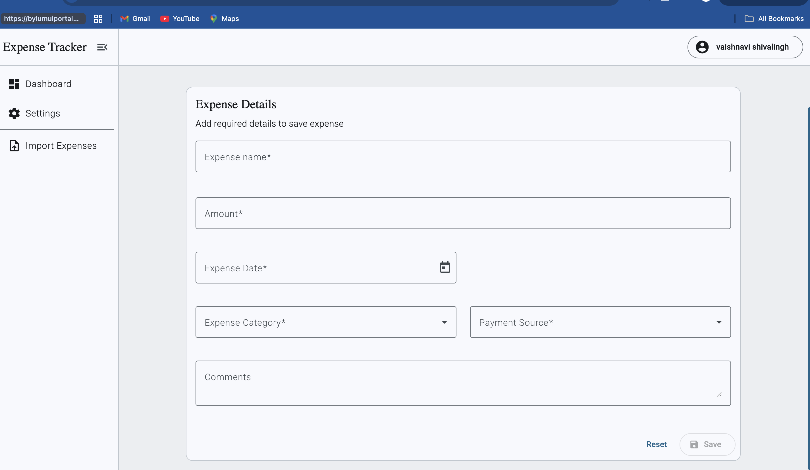
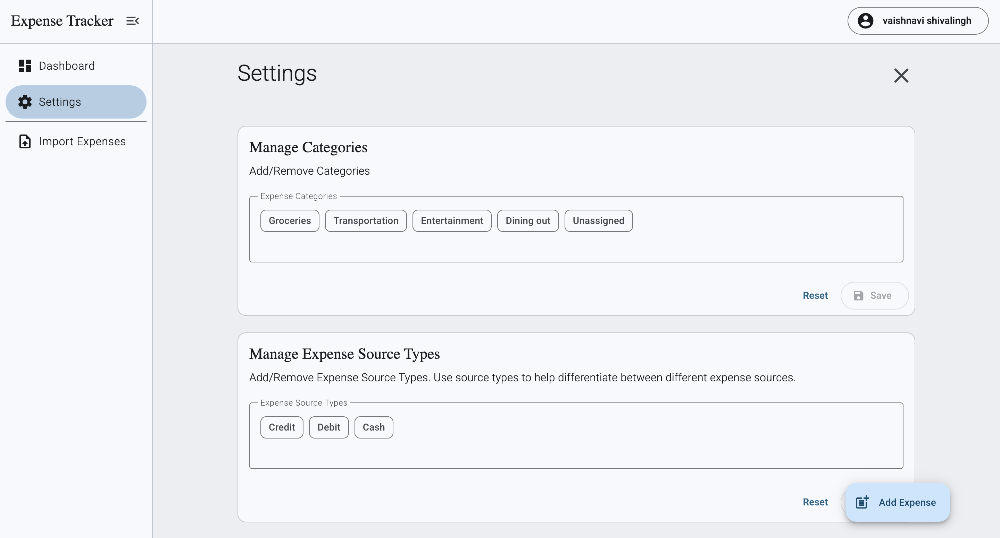

# About Expense Tracker

Expense Tracker is a clean and simple responsive web application designed for efficient expense management. Originally developed with Angular 4, the application has been continuously modernized to leverage the latest Angular features and capabilities.

Built following Material Design guidelines, this application provides an intuitive and user-friendly interface for managing personal or business expenses. Feel free to reach out with any feedback.
## Screenshots

### Dashboard


### Login Page


### Expenses Page



### Settings

## Find app live here

https://expense-tracker-e0028.firebaseapp.com/

## Technologies Used

* Angular 19
* Firebase
* AngularFire
* Angular Material
* Material Design 3
* Highcharts
* Bootstrap Grid System & Utilities Classes

## Key Features

* Authentication & Authorization
  - User registration and login functionality
  - Firebase authentication integration
  - Protected routes with auth guards
* Dashboard Features
  - Interactive dashboard with expense summaries
  - Monthly summary charts
  - Category summary charts
  - Data filtering
  - Bulk editing capabilities for expenses
  - Tabular view of expenses

* Expense Management
  - Add new expenses
  - Edit existing expenses
  - Delete expenses
  - Categorize expenses
  - Track expense sources/payment types

* Settings Management
  - Customize expense categories
  - Manage expense source types
  - User-specific settings persistence
  - Default categories and types for new users

* Data Import Capabilities
  - CSV file import functionality
  - Data validation for imports
  - Review imported expenses before saving
  - Bulk import support

* Technical Features
  - Firebase integration for data storage
  - Real-time data updates
  - Responsive Material Design 3 UI
  - Progressive Web App capabilities
  - Client-side routing
  - Lazy-loaded components

## Roadmap for future updates

- [x] Update to Material Design 3
- [x] Redesign Login/ Registration Page
- [x] Configurable metadata for expenses.
- [x] Update Interactive Dashboard with filtering capabilities
- [ ] Import expenses redesign


## Development server

To start a local development server, run:

```bash
ng serve
```

Once the server is running, open your browser and navigate to `http://localhost:4200/`. The application will automatically reload whenever you modify any of the source files.

## Code scaffolding

Angular CLI includes powerful code scaffolding tools. To generate a new component, run:

```bash
ng generate component component-name
```

For a complete list of available schematics (such as `components`, `directives`, or `pipes`), run:

```bash
ng generate --help
```

## Building

To build the project run:

```bash
ng build
```

This will compile your project and store the build artifacts in the `dist/` directory. By default, the production build optimizes your application for performance and speed.

## Running unit tests

To execute unit tests with the [Karma](https://karma-runner.github.io) test runner, use the following command:

```bash
ng test
```

## Running end-to-end tests

For end-to-end (e2e) testing, run:

```bash
ng e2e
```

Angular CLI does not come with an end-to-end testing framework by default. You can choose one that suits your needs.

## Additional Resources

For more information on using the Angular CLI, including detailed command references, visit the [Angular CLI Overview and Command Reference](https://angular.dev/tools/cli) page.

# Steps for deploying to firebase hosting

`ng build --prod`

Make sure you have firebase tools installed
`npm install -g firebase-tools`

If firebase is not initialized
`firebase init`

Last but not least deploy it to firebase
`firebase deploy`
